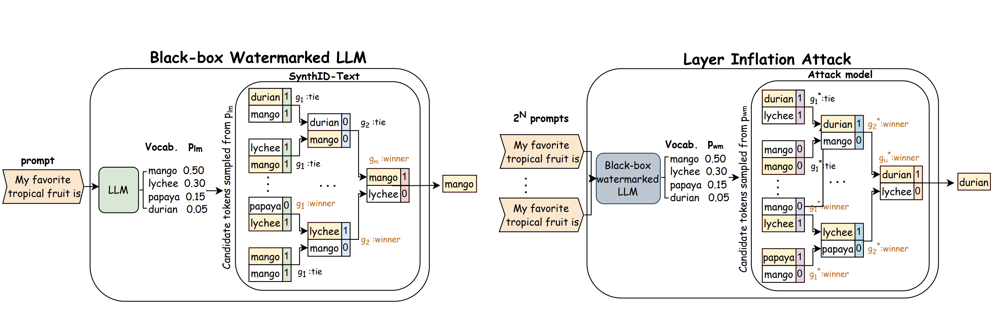

# Break SynthID

## Overview

This repository contains:

- An empirical evaluation notebook:
- Synth_ID_Empirical_Analysis.ipynb

The goal of this project is to reproduce, analyze, and extend experiments evaluating the robustness and detectability of Google’s SynthID watermarking mechanism for large language models (LLMs).

This work investigates:

- Statistical detectability of watermark signals

- False positive rate (FPR) vs. true positive rate (TPR) behavior

- Likelihood ratio–based detection

- Robustness under paraphrasing and transformations

- Distributional shifts between watermarked and non-watermarked outputs

## Key Contributions

-   Theoretical proof that TPR@FPR is unimodal in the number of
    tournament layers
-   Central Limit Theorem analysis of the mean score function
-   Black-box Layer Inflation Attack
-   Empirical validation on multiple LLMs

## Paper Summary
The referenced paper studies the robustness of Google’s SynthID watermarking system, which embeds imperceptible statistical signals into LLM outputs.

Key contributions of the paper:

- Formalization of watermark detection as a hypothesis testing problem

- Evaluation of robustness under paraphrasing and rewriting attacks

- Empirical measurement of detection performance degradation

- Analysis of adversarial and black-box settings

- Theoretical characterization of detection thresholds

The detection task is modeled as:

- H₀: Text generated by a non-watermarked model

- H₁: Text generated by a watermarked model

Optimal detection is derived using likelihood ratio testing (LRT).

## Attack Summary

The Layer Inflation Attack:

1.  Queries the watermarked model multiple times
2.  Collects candidate outputs
3.  Applies additional tournament layers
4.  Produces a final output with reduced mean score
5.  Bypasses watermark detection

## Experimental Setup

-   Dataset: ELI5
-   Tokens per sample: 100
-   FPR: 1%
-   Default layers: m = 30
-   Inflation layers: N = 15
-   Temperature: 1.0

## Key Experiments to Reproduce

- Detection at FPR = 0.01

- Detection performance vs. sequence length

- Robustness under paraphrasing

- Effect of distribution shift

- Comparison between theoretical and empirical thresholds

## Results

The notebook demonstrates:

- Watermark detection is statistically powerful under clean conditions.

- Detection performance degrades under strong paraphrasing.

- Threshold calibration is critical for low FPR regimes.

- Empirical π̂ / π ratios reveal distribution distortion.

- Robustness depends heavily on generation temperature and attack strength.

## Reproducibility Notes

- Fix random seeds for deterministic behavior.

- Ensure identical tokenizer between base and watermark models.

- Use sufficiently large sample sizes for stable FPR estimation.

- Avoid mixing model architectures during likelihood estimation.

## Structure
.
├── Synth_ID_Empirical_Analysis.ipynb
└── README.md

## License

Research and educational use only.
